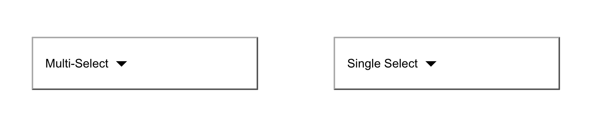
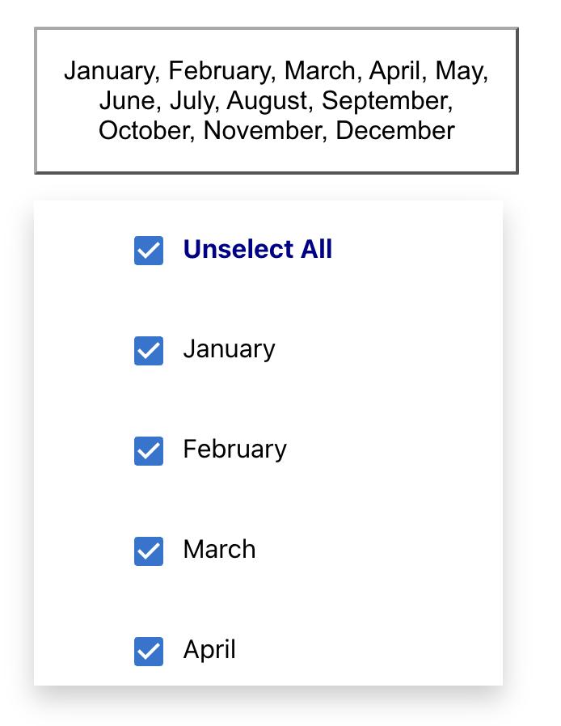
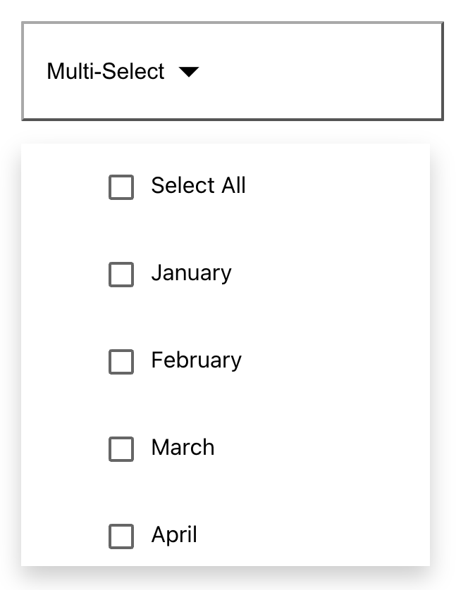
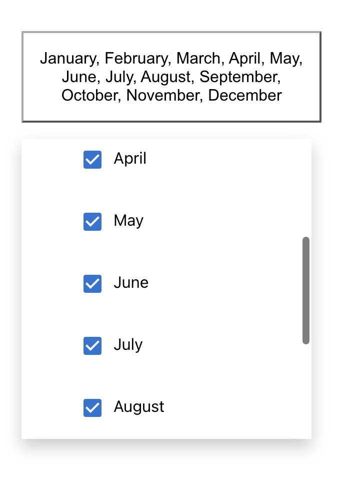
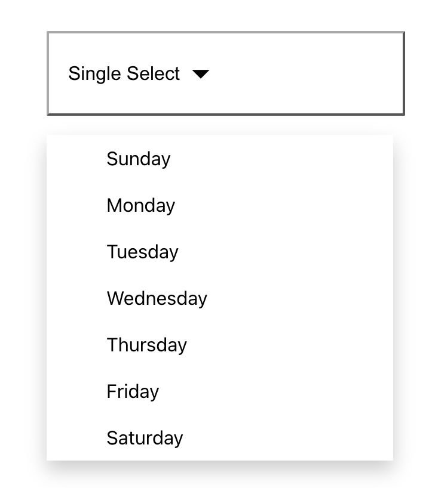
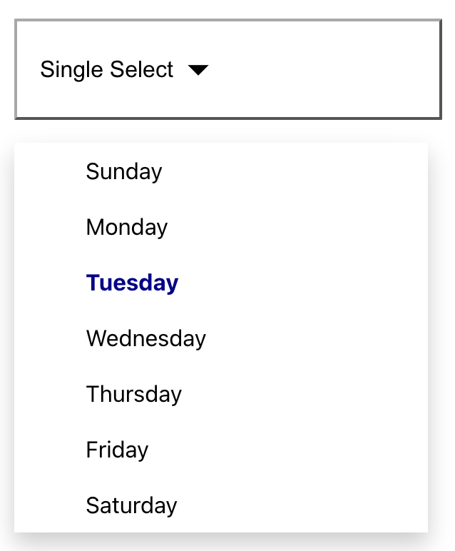

# React JS: Dropdown List Component

```
Apoorva Kaushik
January 20, 2022
```
This project was bootstrapped with [Create React App](https://github.com/facebook/create-react-app).

---
## Running the Project

`cd dropdown-demo` to enter the correct directory.

Begin by running the following commands in terminal to install a few icons that were used in this project.
```
npm install @mui/material @emotion/react @emotion/styled

npm install @mui/material @emotion/react @emotion/styled
```

Next run `npm start` in terminal which will run the app in development mode.

Open [http://localhost:3000](http://localhost:3000) to view it in your browser.

---
## Output



This is front page with a multi-select and single-select



This is multi-select UI with all selected.



This is multi-select UI with nothing selected



This is multi-select UI with nothing selected



This is single select UI.



This is single select UI with highlighting.
